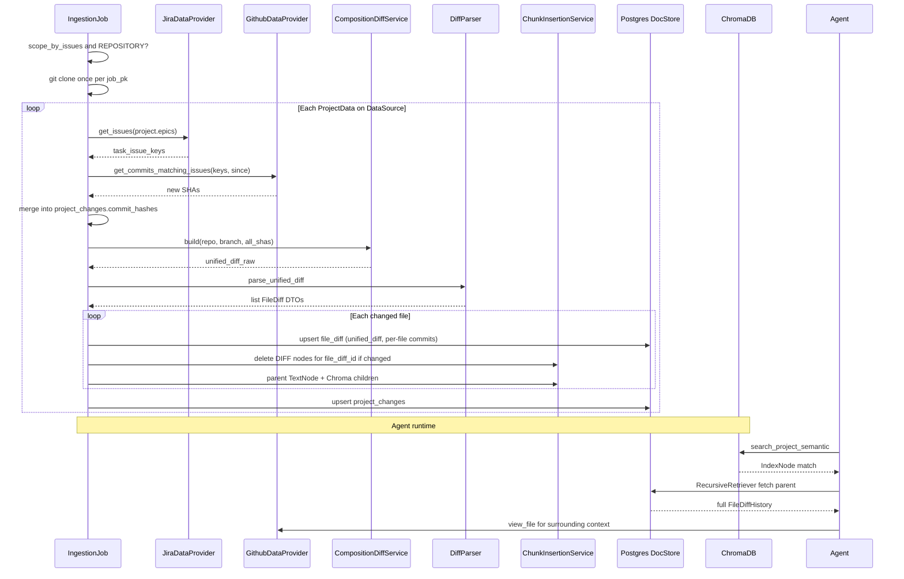

# Project Scoping: Final Implementation Plan

> **Status:** Authoritative reference for implementing project-scoped repository ingestion and agent tooling.  
> **Approach:** **B — Finalized composition diff** (local clone + sequential patch application + net diff vs. base branch).  
> **Storage:** Same DocStore namespace and Chroma collection as existing code chunks; isolate project diff nodes via `source_type` + `project_id` metadata (not separate namespaces).  
> **Source of truth for implemented behavior:** Current codebase (e.g. `scope_by_issues` on `DataSource`, provider refactor) overrides older plan documents where they conflict.

---

## Table of Contents

1. [Problem Statement](#1-problem-statement)
2. [Locked Design Decisions](#2-locked-design-decisions)
3. [Current Implementation Status](#3-current-implementation-status)
4. [Architecture Overview](#4-architecture-overview)
5. [Data Models](#5-data-models)
6. [Composition Diff: Mechanism](#6-composition-diff-mechanism)
7. [Ingestion Flow](#7-ingestion-flow)
8. [Diff Parsing & FileDiffHistory](#8-diff-parsing--filediffhistory)
9. [Persistence: DocStore & Chroma](#9-persistence-docstore--chroma)
10. [Agent Tooling](#10-agent-tooling)
11. [Prompts & Anti-Hallucination](#11-prompts--anti-hallucination)
12. [Provider & API Extensions](#12-provider--api-extensions)
13. [Phased Implementation Roadmap](#13-phased-implementation-roadmap)
14. [Edge Cases & Fallbacks](#14-edge-cases--fallbacks)
15. [Operational & Infrastructure Notes](#15-operational--infrastructure-notes)
16. [Testing Strategy](#16-testing-strategy)
17. [Future Work](#17-future-work)
18. [Appendix: End-to-End Data Flow](#18-appendix-end-to-end-data-flow)

---

## 1. Problem Statement

Today, when a **Project** links to a **Repository DataSource**, the agent treats the entire repository as in scope. In practice, a project only changes a subset of the codebase (tracked via Jira epics → stories/tasks → commits whose messages reference those issue keys).

**Goal:** During ingestion, compute a **single net “composition diff”** per `(project, repository data source)` that represents *only* what that project changed—ignoring unrelated commits on the same branch. Persist that diff in DocStore + Chroma so the agent can:

- Search **project changes** with dedicated tools (semantic + grep).
- Search **full codebase** with existing tools for surrounding context.
- Traverse files via `view_file` / `list_directory` without restriction.

---

## 2. Locked Design Decisions

| Topic | Decision | Rationale |
|-------|----------|-----------|
| Scoping flag location | `DataSource.scope_by_issues` (implemented) | A data source is shared; scoping is a property of how that repo is ingested, not a per-project override that could disagree across projects. |
| How work is attributed | **Commit messages** containing resolved issue keys (from Jira epics) | More reliable than branch-name → PR heuristics; works with squash merges and multiple issues per commit. |
| Diff strategy | **Approach B — composition diff** | One net BEFORE/AFTER per file; net-zero changes disappear; UI-ready unified diff; no overlapping-hunk confusion for the agent. |
| DocStore namespace | **Same** as code: `str(data_source.id)` | User preference; filter with `source_type=DIFF` + `project_id`. |
| Chroma collection | **Same** project collection as code chunks | Filter with metadata; parent-child via `IndexNode.index_id`. |
| General search | `semantic_search` / `grep_search` exclude `source_type=DIFF` | Prevents diff chunks from polluting broad codebase search. |
| Traversal tools | `view_file` / `list_directory` **unrestricted** | Agent needs full repo context beyond project edits. |
| Relational storage for diff text | **Per-file in `file_diff`** — unified diff + metadata; not one blob on `project_changes` | Enables incremental sync and per-file commit attribution. Agent-facing narrative text remains in DocStore. Lifecycle decoupled from `File` (§5.4.1). |
| Issue tracker linkage | Project must have **exactly one** linked `ISSUE_TRACKER` DataSource | Per `flow.md`; fail ingestion step for that project if missing. |
| Incremental sync | `project_changes` + `last_synced_at` via `IngestionJob` FK | Re-fetch only new commits since last successful sync. |
| Branch tip tracking | **No `base_ref_sha` in v1** | Commit-driven sync is sufficient for attribution; branch-tip refresh deferred (see §5.4.2, §17). |
| `file_diff` vs `File` lifecycle | **Decoupled** — no FK cascade from `file` → `file_diff` | Code ingest may delete stale `File` rows; project diff history (especially **deleted** paths) must survive for the agent (see §5.4.1). |
| Deleted / moved paths | **Retain** `file_diff` + DIFF nodes when project net-deletes or path is abandoned | Agent must still answer “what did we remove?” even when `File` row is gone; cleanup only via project-diff sync rules. |

### Explicitly rejected (for this phase)

- **Approach A (per-commit hunk aggregation via API):** Overlapping hunks, net-zero noise, no clean UI diff.
- **Cherry-pick replay:** Conflicts when multiple commits touch the same file; fragile.
- **`git diff A...B` on main:** Includes unrelated commits between A and B.
- **Separate DocStore namespace per project:** Replaced by metadata filtering on same namespace.
- **PR-based resolution as primary path:** `resolve_prs` / `get_pr_diff` on `GithubDataProvider` may remain for other features but are **not** the ingestion source of truth for this feature.

---

## 3. Current Implementation Status

### Done

| Area | Location | Notes |
|------|----------|-------|
| `scope_by_issues` on `DataSource` | `app/models/data_source.py`, Pydantic + service | Validated: only for `REPOSITORY` type. |
| Provider hierarchy | `app/data_providers/` | `IngestibleDataProvider` / `RepositoryDataProvider` / `FetchableDataProvider` / `IssueTrackerDataProvider`. |
| `JiraDataProvider.get_issues(epics)` | `fetchable/issue_tracker/jira.py` | Epic → story keys via JQL. |
| `GithubDataProvider` stubs | `ingestible/repository/github.py` | `resolve_prs`, `get_pr_diff` exist (legacy / optional). |
| Ingestion pipeline shell | `IngestionJobService.run_ingestion_job` | Code + docs chunking; temp dirs + cleanup. |
| DocStore insert | `ChunkInsertionService._add_nodes_to_docstore` | Namespace `str(data_source.id)`. |
| Chroma per project | `ChromaService` + `ChunkInsertionService._save_to_chroma_db` | Project-scoped collections. |
| Agent tools (general) | `app/agents/tools.py` | `semantic_search`, `grep_search`, per-DS `view_file` / `list_directory`. |
| `Project.epics` | `app/models/project.py` | Epic keys for issue resolution. |

### Not done (this plan)

- `project_changes` + `file_diff` tables and Alembic migrations
- Commit discovery by message (GitHub API)
- `CompositionDiffService` (clone, apply, diff)
- `diff_parser` / `FileDiffHistory` builder
- `resolve_and_store_project_diffs()` in ingestion
- DIFF node deletion on re-ingest
- Project-scoped search tools + `list_project_files`
- `RecursiveRetriever` for parent swap
- Prompt / workflow wiring
- `GithubDataProvider` commit APIs

---

## 4. Architecture Overview

```
┌─────────────────────────────────────────────────────────────────────────────┐
│                         Nightly IngestionJob (per DataSource)                  │
├─────────────────────────────────────────────────────────────────────────────┤
│  1. Existing: download repo files → code_chunk_and_store (all projects)      │
│  2. Existing: docs_convert_chunk_and_store                                   │
│  3. NEW (if REPOSITORY && scope_by_issues):                                    │
│       For each ProjectData on this DataSource:                                 │
│         a. Resolve issue keys (Jira)                                         │
│         b. Discover new commits (GitHub, message match, since last_sync)       │
│         c. Merge commit set → project_changes.commit_hashes                      │
│         d. ONE clone per job → composition_diff(all commits)                   │
│         e. Per file: upsert file_diff (skip if commit set + base unchanged)    │
│         f. Parse → FileDiffHistory → DocStore parent + Chroma children         │
│         g. Update project_changes + file_diff rows                             │
└─────────────────────────────────────────────────────────────────────────────┘

┌─────────────────────────────────────────────────────────────────────────────┐
│                              Agent Runtime                                   │
├─────────────────────────────────────────────────────────────────────────────┤
│  Lens (project):  search_project_semantic, search_project_grep,              │
│                   list_project_files                                         │
│  Context (full):  semantic_search, grep_search (exclude DIFF)                │
│  Traverse:        view_file_*, list_directory_* (unrestricted)               │
└─────────────────────────────────────────────────────────────────────────────┘
```

**Mental model:** Project tools = **lens** on what changed. General tools = **surrounding codebase**. Traversal = **live repo** via provider APIs.

---

## 5. Data Models

### 5.1 Existing (no change required for flag)

```python
# data_source.py — already implemented
scope_by_issues: Mapped[bool] = mapped_column(default=False, ...)
```

### 5.2 New: `project_changes` (aggregate sync state)

One row per `ProjectData` (composite FK to `project` + `data_source`). Tracks **project-wide** commit discovery and denormalized summaries. Does **not** store the full multi-file unified diff.

Aligns with in-progress model at `app/models/project_changes.py`:

```python
# app/models/project_changes.py

class ProjectChanges(Base):
    __tablename__ = "project_changes"

    # PK = project_data composite key (one row per project ↔ repository DS)
    project_data_id: Mapped[UUID]  # FK → project_data (project_id + data_source_id)

    ingestion_job_id: Mapped[UUID] = mapped_column(ForeignKey("ingestion_job.id"))

    # Full ordered set of SHAs attributed to this project on this repo (not delta-only)
    commit_hashes: Mapped[list[str]] = mapped_column(ARRAY(String))

    # Denormalized manifest (recomputed each sync from file_diff rows)
    files_touched: Mapped[list[str]] = mapped_column(ARRAY(String))
    file_count: Mapped[int] = mapped_column(default=0)

    # Relationships: project_data, ingestion_job, file_diffs (one-to-many)
```

**`last_synced_at`:** Derive from `ingestion_job.end_time` (or `created_at` on the linked job) rather than duplicating on this row.

**Relationships:**

- `project_data_id` ↔ `ProjectData` (same scope as ingestion loop in `flow.md`).
- `ingestion_job_id` → which job last successfully updated this aggregate row.
- `file_diffs` → one row per touched path (see §5.3).

### 5.3 New: `file_diff` (per-file composition + incremental unit)

One row per `(project_changes, file path)` for each file in the net composition diff.

```python
# app/models/file_diff.py

class FileDiff(Base):
    __tablename__ = "file_diff"

    id: Mapped[UUID] = mapped_column(primary_key=True, server_default=gen_random_uuid())

    project_changes_id: Mapped[UUID] = mapped_column(
        ForeignKey("project_changes.project_data_id"), index=True
    )

    file_id: Mapped[UUID | None] = mapped_column(
        ForeignKey("file.id"), index=True, nullable=True,
        comment="Resolved File row for this path on the data source; NULL if not yet ingested as code",
    )
    file_path: Mapped[str] = mapped_column(
        String, nullable=False,
        comment="Repo-relative path; kept when file row is removed",
    )

    # Subset of project_changes.commit_hashes that modify this path
    commit_hashes: Mapped[list[str]] = mapped_column(ARRAY(String))

    change_type: Mapped[str]  # added | modified | deleted (see §5.4.1)

    # Canonical machine representation (see §5.5)
    unified_diff: Mapped[str | None] = mapped_column(Text, nullable=True)
    diff_hash: Mapped[str] = mapped_column(String(64))  # sha256(unified_diff or '')

  # When True, do not delete this row when FileService removes the linked File row (deleted/moved paths)
    retain_after_file_removed: Mapped[bool] = mapped_column(default=False)

    ingestion_job_id: Mapped[UUID] = mapped_column(ForeignKey("ingestion_job.id"))
    synced_at: Mapped[datetime]  # copy of ingestion_job.end_time when this row was written; agent "as of" label

    __table_args__ = (
        UniqueConstraint("project_changes_id", "file_path", name="uq_file_diff_project_changes_path"),
    )
```

**Why both `file_id` and `file_path`:**

- `file_path` is the **primary identity** for diff rows and DocStore metadata (matches composition output).
- `file_id` is an **optional link** to the current code-ingest `File` at that path when it exists — used for convenience only, **not** for lifecycle/cascade delete (see §5.4.1).

**Per-file commit attribution:**

```python
# After merge into project_changes.commit_hashes:
for sha in all_commits:
    touched_paths = provider.get_commit_changed_paths(sha)  # or git show --name-only
    for path in touched_paths:
        file_commit_map[path].add(sha)
# file_diff.commit_hashes = sorted chronologically ⊆ project_changes.commit_hashes
```

### 5.4 Incremental sync (commit-driven; no `base_ref_sha` in v1)

Incremental behavior is driven by **project commit discovery**, not branch-tip tracking.

**Tier 0 — entire project diff step**

```text
new_shas = commits from API since last_sync not already in project_changes.commit_hashes
IF new_shas is empty:
  SKIP composition + skip all file_diff / DocStore / Chroma work for this ProjectData
```

This matches `flow.md`: if nothing new attributed to the project, do not re-run cherry-pick or re-embed.

**Tier 1 — composition (only when Tier 0 has new SHAs)**

```text
all_commits = merge_unique(project_changes.commit_hashes, new_shas)
composition = CompositionDiffService.build(..., all_commits)  # always full set
```

You cannot skip composition when *any* new project commit exists (composite state is global).

**Tier 2 — per-file persist (after composition)**

Build `file_commit_map[path]` = subset of `all_commits` whose patches touch `path` (from `git show --name-only` per SHA or composition output).

```text
FOR each path in composition_result.files:
  new_file_commits = file_commit_map[path]
  existing = file_diff WHERE project_changes_id AND file_path

  IF existing
     AND set(existing.commit_hashes) == set(new_file_commits)
     AND existing.diff_hash == sha256(new_unified_diff_for_path):
       SKIP DocStore/Chroma for this path
  ELSE:
       upsert file_diff; rewrite DIFF nodes for this path

FOR each existing file_diff row:
  IF file_path NOT IN composition.paths_with_net_change:
    IF existing.change_type == 'deleted' OR existing.retain_after_file_removed:
      KEEP row + DIFF nodes (refresh only if per-file commit_hashes changed)
    ELSE:
      DELETE file_diff + DIFF nodes   # net-zero revert: project no longer changes this path
```

**Detecting new files:** A path appears in `composition_result` but has no `file_diff` row → create row + ingest (no separate “new file detector” beyond composition + missing row).

**Detecting untouched existing files:** New project commits exist, but `new_file_commits` for path X equals `file_diff.commit_hashes` and recomputed `diff_hash` matches → skip re-embed for X. New commits only touched path Y → only Y (and any brand-new paths) get work.

### 5.4.1 Decouple `file_diff` from `File` (retain deleted / moved-path history)

**Problem:** `FileService` treats renames and removals as: new path → new `File`; path missing from job → **stale `File` deleted** from DB plus code chunks removed from DocStore/Chroma. If `file_diff` were tied to `File` lifecycle, deleting the `File` row would also remove the only record that **this project** deleted or moved that path — the agent would lose “we removed X” with no DIFF nodes left.

**Decision:** Project diff rows are owned by **project-diff sync**, not by code ingest.

| Event | `File` / code chunks | `file_diff` / DIFF nodes |
|-------|----------------------|---------------------------|
| Code stale delete (path gone from repo walk) | Delete `File`; remove code DocStore/Chroma by `file_id` | **Do not** auto-delete `file_diff` if `retain_after_file_removed` or `change_type=deleted` |
| Project net-delete in composition | `File` may already be gone | **Upsert** `file_diff` at path with `change_type=deleted`, `retain_after_file_removed=True`, keep FileDiffHistory + embeddings |
| Project rename (our model) | Old `File` stale-deleted; new `File` at new path | Old path: **deleted** row retained; new path: **added** row |
| Project net-zero revert (path no longer in composition) | Unaffected | **Delete** `file_diff` + DIFF nodes (project no longer claims this path) |
| Unlink project / clear scope | Policy TBD | Delete all `file_diff` for that `project_changes_id` |

**Implementation rules:**

1. **No `ON DELETE CASCADE`** from `file.id` → `file_diff.file_id`. Nullable `file_id` only.
2. **`FileService.delete_stale_files` / `remove_chunks_from_docstore`:** Must **not** call project-diff deletion.
3. **`ChunkInsertionService` DIFF delete:** Key off `file_diff_id` / `file_path` + `project_id`, never “all diffs for `file_id`” when removing code.
4. On upsert of `change_type=deleted`, set `retain_after_file_removed=True` and populate DELETED FileDiffHistory (§8.2).
5. **`synced_at`** on `file_diff` (and in DIFF metadata) so prompts can say “project change as of {iso_timestamp}”.

**Renames / moves (align with `FileService` path semantics, not `File` FK continuity):**

| Git / composition shows | `file_diff` behavior |
|-------------------------|----------------------|
| New path with content | `change_type=added`, new row at `file_path`; link `file_id` when code ingest creates `File` |
| Old path net-removed by **project** | `change_type=deleted`, `retain_after_file_removed=True` at **old** `file_path` — **keep** row and DIFF nodes after `File` stale delete |
| Git “rename” hunk | Normalize to **deleted** at old path + **added** at new path (two rows / two parents) |

If composition emits a single rename hunk, split at parse time so agent text matches code-ingest semantics.

### 5.4.2 Known staleness without new project commits (v1 acceptance + follow-ons)

**v1 policy:** Skip project-diff work when **no new issue-linked SHAs** (Tier 0). We intentionally **do not** store `base_ref_sha` or re-compose on unrelated `main` movement alone.

**What still works:** Composition only cherry-picks `project_changes.commit_hashes`, so unrelated team commits are **not attributed** as project work in the stored diff.

**Known gap (accepted for v1):** If the diff was generated earlier and **no new project commits** arrive, but another team **refactors surrounding context** or **moves** a file we touched, the stored FileDiffHistory can show stale SURROUNDING CONTEXT / BEFORE/AFTER framing while `view_file` shows current `main`. The agent might over-interpret context lines unless prompted otherwise — e.g. “we only added `OR`” but surrounding code changed later.

This is **staleness / grounding**, not false commit attribution. Mitigations are follow-on work (§17), not v1 blockers.

**Follow-on resilience (document as Phase 8+ / future):**

| Item | Purpose |
|------|---------|
| Optional `base_ref_sha` + scheduled “branch refresh” | Re-run composition when tip moves even without new project SHAs; refresh diff vs current `main` |
| `synced_at` in tool output + prompts | “Project diff as of {date}; use `view_file` for current file contents” |
| Drift detector | Compare `file_diff.diff_hash` or path existence vs live provider; flag files where `File` missing or path 404 |
| Path relocation hints | If project diff path 404 but similar file exists on `main`, suggest `view_file` at new path (heuristic; do not auto-merge rename) |
| Narrow context in FileDiffHistory | Prefer minimal BEFORE/AFTER hunks; trim SURROUNDING CONTEXT when regenerating to reduce misleading context |
| Conflict / failed cherry-pick surfacing | Expose `failed_commits` in planning summary so agent does not trust partial diffs |

### 5.5 What to store in `file_diff` (storage format)

| Store in Postgres | Store in DocStore | Do **not** use (v1) |
|-------------------|-------------------|---------------------|
| Per-file **unified diff** string (`git diff` hunk output for one path) | **FileDiffHistory** — formatted BEFORE/AFTER narrative for the agent | One row per hunk |
| `diff_hash` for cheap equality checks | Parent `TextNode.text` | Full-repo diff on `project_changes` |
| `commit_hashes` per file | — | Duplicate full FileDiffHistory in Postgres |

**Recommendation:** Store the **file-scoped unified diff** (output of `unidiff` / `git diff BASE COMPOSITE_HEAD -- <path>`), not individual hunks as separate rows. Hunks are parsed **in memory** at ingest to build FileDiffHistory; optionally cache parsed hunks in JSONB later if profiling shows parse cost matters.

For very large files:

- Cap `unified_diff` size (e.g. 512 KB); set `truncated: true` in metadata.
- Optionally `BYTEA` + gzip for UI export only; agent path uses truncated FileDiffHistory in DocStore.

**Reconstructing “whole project diff”:** `SELECT unified_diff FROM file_diff WHERE project_changes_id = ? ORDER BY file_path` and concatenate — suitable for a future UI viewer, not for agent search.

### 5.6 DocStore vs Postgres — division of responsibility

| Concern | Postgres (`file_diff`) | DocStore + Chroma |
|---------|------------------------|-------------------|
| Incremental sync / skip unchanged | Tier 0: no new project SHAs; Tier 2: per-file `commit_hashes` + `diff_hash` | — |
| Per-file commit attribution | `file_diff.commit_hashes` | optional copy in parent metadata |
| Semantic / grep search for agent | — | **Required** — existing parent/child pattern |
| Cleanup when code `File` stale-deleted | **No** auto-delete of `file_diff` | DIFF nodes kept when `retain_after_file_removed` or `change_type=deleted` |
| Cleanup when project drops path (net-zero) | Delete `file_diff` row | Delete DIFF by `file_diff_id` / `file_path` + `project_id` |
| UI “view diff” later | `unified_diff` per file | optional mirror |

**Answer:** Yes, keep DocStore (and Chroma). Postgres holds **sync truth and canonical diff bytes**; DocStore holds **agent-optimized narrative**; Chroma holds **embeddings**. Querying all `file_diff` rows replaces semantic search only if you load everything into the LLM — not viable for large projects.

Add `file_diff_id` (and `file_id`) to DIFF node metadata so deletes are precise without scanning the whole namespace.

### 5.7 Pydantic / service DTOs (ingestion internals)

```python
@dataclass
class DiffHunk:
    file_path: str
    change_type: Literal["added", "modified", "deleted", "context_only"]
    before_lines: list[str]   # lines removed (-)
    after_lines: list[str]    # lines added (+)
    context_lines: list[str]  # context (space prefix)
    raw_hunk: str             # original @@ hunk header + body

@dataclass
class FileDiff:
    file_path: str
    change_type: Literal["added", "modified", "deleted", "renamed"]
    hunks: list[DiffHunk]
    # For renames: old_path in metadata

@dataclass
class CompositionDiffResult:
    files: list[FileDiff]
    unified_diff_raw: str          # full composition diff string
    commit_hashes: list[str]       # ordered chronologically
    failed_commits: list[str]      # SHAs that could not be applied (fallback)
```

### 5.8 Node metadata contract (DocStore + Chroma)

All DIFF nodes **must** include:

```python
{
    "source_type": "DIFF",
    "project_id": str(project_id),
    "data_source_id": str(data_source_id),
    "file_diff_id": str(file_diff.id),
    "file_id": str(file_id) if file_id else None,
    "file_path": "src/auth/handler.py",
    "change_type": "modified",           # file-level on parent
    "change_types": ["modified"],        # list for multi-hunk files
    "commit_count": 3,                   # len(file_diff.commit_hashes)
}
```

Child `IndexNode` chunks duplicate `source_type`, `project_id`, `data_source_id`, `file_path` for Chroma filtering.

Code chunks continue using existing metadata (no `source_type` or `source_type != "DIFF"`).

---

## 6. Composition Diff: Mechanism

### 6.1 Why Approach B

| Requirement | Composition diff | Hunk aggregation |
|-------------|------------------|------------------|
| Net state per file | Single BEFORE/AFTER | Overlapping hunks; agent must infer |
| Add then delete same code | Absent from diff | Both ADDED and DELETED appear |
| UI diff viewer later | Concatenate `file_diff.unified_diff` | Must re-derive |
| Agent reasoning | Trivial read | Hard inference |

### 6.2 Algorithm (recommended)

**One blobless clone per `IngestionJob`** (shared across all `project_data` records on that repository data source in the same job).

```text
INPUT:
  repo_url, branch, commit_hashes[]  # chronological by committer date

STEPS:
  1. git clone --filter=blob:none --no-checkout <url> <tmpdir>/<job_pk>/repo
  2. cd repo && git checkout <branch>
  3. BASE := git rev-parse HEAD

  4. git worktree add <tmpdir>/<job_pk>/composite --detach BASE
     # OR: git checkout -b project-composite-<job_pk>

  5. On composite worktree:
       git reset --hard BASE
       git checkout -B project-composite-empty

       For each sha in commit_hashes (oldest → newest):
         Try:
           git cherry-pick -n <sha>
         On conflict:
           git cherry-pick --abort
           git show <sha> --format=email-patch | git apply --3way --ignore-whitespace
           # if still fails: record sha in failed_commits; continue or abort file

  6. COMPOSITE_HEAD := git rev-parse HEAD
  7. unified_diff := git diff BASE COMPOSITE_HEAD
     # Optionally: --stat, pathspec limit to files touched by any commit in set

  8. Parse unified_diff with `unidiff.PatchSet`
  9. Cleanup worktree / tmpdir in finally block (reuse IngestionJobService._cleanup_tmp_dirs pattern)
```

**Why `cherry-pick -n` (no commit) on BASE instead of orphan + empty tree:**

- `git diff BASE COMPOSITE_HEAD` yields proper **modified** hunks (real BEFORE from BASE, AFTER from composite).
- Orphan-from-empty produces “entire file added” for modifications and loses true BEFORE.

**Why not `git diff A...B` on main:** Non-contiguous project commits would include unrelated work between A and B.

### 6.3 Commit ordering

```python
def sort_commits_chronologically(commits: list[CommitMeta]) -> list[str]:
    return [c.sha for c in sorted(commits, key=lambda c: c.committer_date)]
```

Fetch metadata via `GET /repos/{owner}/{repo}/commits/{sha}` or `git log --format=%H %ct` after clone.

### 6.4 Failure handling

| Failure | Action |
|---------|--------|
| Single commit conflicts on cherry-pick | Fall back to `git apply --3way` for that commit only |
| Apply still fails | Add SHA to `failed_commits`; log warning; optionally exclude file from composition or abort project sync |
| Clone timeout / disk | Fail `project_changes` update; leave previous sync row; mark ingestion job partial success (define policy) |
| Empty commit set | Skip diff persistence; clear DIFF nodes if previously existed |

### 6.5 Per-file diff extraction

After `git diff BASE COMPOSITE_HEAD`, split by file (via `unidiff.PatchSet` or path-filtered `git diff BASE COMPOSITE_HEAD -- <path>`) and persist each slice on `file_diff.unified_diff`. Do **not** store the full multi-file blob on `project_changes`.

### 6.6 Container requirements

- `git` >= 2.20 in backend image
- Writable temp: `{TMP}/{job_pk}/repo` (align with existing `TMP_CODE` patterns)
- `GIT_TERMINAL_PROMPT=0` for non-interactive runs

---

## 7. Ingestion Flow

Aligned with [`apps/backend/flow.md`](apps/backend/flow.md).

### 7.1 Preconditions

```python
def should_run_project_scoping(data_source: DataSource) -> bool:
    return (
        data_source.type == DataSourceType.REPOSITORY
        and data_source.scope_by_issues is True
    )
```

### 7.2 Hook point in `IngestionJobService.run_ingestion_job`

```python
# After code_chunk_and_store (and docs if any), BEFORE _cleanup_tmp_dirs:

if should_run_project_scoping(data_source):
    await self.chunk_insertion_service.resolve_and_store_project_diffs(
        data_source=data_source,
        job_pk=job_pk,
        repo_clone_path=...,  # from shared clone step
    )

self._cleanup_tmp_dirs(job_pk)  # existing
```

**Important:** Run composition diff **before** deleting the job temp clone, or perform clone in `resolve_and_store_project_diffs` and delete in `finally`.

### 7.3 Per-`ProjectData` steps

For each `project_data` where `data_source` is the repository being ingested:

```
1. Load Project (epics), ProjectData, existing project_changes (if any)

2. Resolve IssueTrackerDataProvider:
   - Find linked DataSources for project where type == ISSUE_TRACKER
   - Require exactly one → else raise / log error and skip this project

3. task_issue_keys = IssueTracker.get_issues(project.epics)
   - Always refresh (new stories may appear under epics)

4. last_sync_time = project_changes.last_synced_at if exists else None

5. new_commits = RepositoryProvider.get_commits_matching_issues(
       issue_keys=task_issue_keys,
       since=last_sync_time,
   )
   - If no project_changes: all matching commits on branch (paginated)
   - Else: commits after last_sync_time with message containing any issue key

6. all_commits = merge_unique(project_changes.commit_hashes, new_commits.shas)

7. composition = CompositionDiffService.build(repo_path, data_source.branch, all_commits)

8. For each file in composition:
       - Compute per-file commit_hashes (subset of all_commits)
       - Resolve file_id from File table (data_source_id + path)
       - If file_diff unchanged (§5.4): skip vector/doc rewrite
       - Else: upsert file_diff; persist_project_file_diff → DocStore + Chroma

9. Upsert project_changes:
       commit_hashes, files_touched, file_count, ingestion_job_id

10. Reconcile file_diff rows (§5.4): delete only net-zero paths; retain deleted / retain_after_file_removed
```

### 7.4 Issue key matching in commit messages

```python
def commit_matches_issues(message: str, issue_keys: list[str]) -> bool:
    # Word-boundary style match: PROJ-123 should not match PROJ-1234
    for key in issue_keys:
        if re.search(rf'\b{re.escape(key)}\b', message, re.IGNORECASE):
            return True
    return False
```

**Prerequisite for teams:** Document that commits must reference issue keys in messages.

### 7.5 Freshness / re-ingestion

On each successful project diff sync:

1. Recompute composition from full `commit_hashes` (composition is always whole-set).
2. **Per file:** if `file_diff` row is new or per-file `commit_hashes` / `diff_hash` changed → delete DIFF nodes for that `file_path` (or `file_diff_id`) only, then re-insert.
3. **Paths dropped** from net composition → delete `file_diff` only if not `deleted` / `retain_after_file_removed` (net-zero revert).
4. Upsert `project_changes` aggregate fields.

Full wipe of all DIFF nodes for `(project_id, data_source_id)` remains a valid fallback on schema migration or corruption recovery, but is not required every sync when file-level hashing is in place.

---

## 8. Diff Parsing & FileDiffHistory

### 8.1 Parser service

**File:** `app/services/diff_parser.py`

```python
from unidiff import PatchSet

def parse_unified_diff(raw: str) -> list[FileDiff]:
    patch_set = PatchSet(raw)
    ...
```

**Per hunk classification:**

| `-` lines | `+` lines | `change_type` |
|-----------|-----------|---------------|
| yes | yes | `modified` |
| no | yes | `added` |
| yes | no | `deleted` |
| whitespace only | whitespace only | `context_only` → **skip** |

Extract:

- `before_lines` from `-` prefixed lines (strip prefix)
- `after_lines` from `+` prefixed lines
- `context_lines` from ` ` prefixed lines

### 8.2 FileDiffHistory text (parent node body)

One **parent `TextNode` per file** in the composition diff. No LLM generation.

```text
[PROJECT CHANGE | MODIFIED | src/auth/handler.py]
Net project change vs. branch {branch}. Synced at {synced_at} (use view_file for current contents).
Commits included: abc1234, def5678 (3 total)

--- Hunk 1 (MODIFIED) ---
BEFORE:
    if request.auth_type == 'oauth2':
AFTER:
    if request.auth_type == 'oauth2' or request.auth_type == 'saml':
SURROUNDING CONTEXT:
def handle_auth(request):
    ...

--- Hunk 2 (MODIFIED) ---
...
```

**ADDED file** (no BEFORE):

```text
[PROJECT CHANGE | ADDED | src/auth/saml_handler.py]
...
ADDED CODE:
def handle_saml(request):
    ...
```

**DELETED file:**

```text
[PROJECT CHANGE | DELETED | src/auth/legacy.py]

WARNING: The following code was REMOVED by this project and NO LONGER EXISTS in the codebase.

REMOVED CODE:
...
```

### 8.3 Parent node ID stability

```python
def parent_node_id(file_diff_id: UUID) -> str:
    return f"diff_{file_diff_id}"  # or hash of file_diff_id for fixed width
```

Prefer **`file_diff_id`** as the stable key so renames update `file_path` on the same row without orphan DocStore nodes.

### 8.4 Large files

| Case | Policy |
|------|--------|
| File diff text > N tokens (e.g. 8k) | Truncate SURROUNDING CONTEXT; keep all BEFORE/AFTER for hunks |
| Binary / generated files | Skip with log (match existing code ingestion ignore rules) |
| Single file dominates diff | Cap hunks included in parent; store `truncated: true` in metadata |

---

## 9. Persistence: DocStore & Chroma

### 9.1 Namespace & collection

| Store | Scope | Namespace / collection |
|-------|--------|-------------------------|
| DocStore | Data source | `str(data_source.id)` — **unchanged** |
| Chroma | Project | Existing `ChromaCollection` for project — **unchanged** |

### 9.2 Parent-child pattern (prevents “lost update”)

**Problem:** If each hunk is embedded separately, semantic search may return hunk 2 of 3; agent misses later changes.

**Solution:**

```
Parent (DocStore TextNode):
  id_ = parent_node_id(...)
  text = full FileDiffHistory
  metadata = { source_type: DIFF, project_id, data_source_id, file_path, ... }

Children (Chroma IndexNodes):
  TokenTextSplitter(chunk_size=512, chunk_overlap=50)
  For each chunk i:
    IndexNode(
      id_ = f"{parent_id}_chunk_{i}",
      text = <chunk of parent text>,
      index_id = parent_id,
      metadata = { source_type: DIFF, project_id, data_source_id, file_path, chunk_index: i }
    )
```

**Retrieval:** `RecursiveRetriever` on project semantic search — matched child → fetch parent `TextNode` from DocStore → agent always sees **full file net diff**.

### 9.3 Insertion implementation

**File:** extend `ChunkInsertionService`

```python
async def resolve_and_store_project_diffs(self, data_source, job_pk, ...): ...

async def persist_project_file_diff(
    self,
    file_diff: FileDiff,
    file_diff_dto: FileDiff,  # parsed hunks / FileDiffHistory input
    project_id: UUID,
    data_source: DataSource,
) -> None:
    await self._delete_diff_nodes_for_file(file_diff.id, file_diff.file_path, project_id, data_source.id)
    parent, children = self._build_diff_nodes(file_diff, project_id, data_source)
    await self._add_nodes_to_docstore([parent], data_source)
    await self._insert_diff_children_to_chroma(children, project_id, data_source)
```

### 9.4 Deleting old DIFF nodes

**DocStore:**

```sql
-- Via DocstoreChunk OR LlamaIndex delete
DELETE FROM docstore_chunk
WHERE namespace = :data_source_id
  AND (value->'__data__'->'metadata'->>'source_type' = 'DIFF'
       OR value->'metadata'->>'source_type' = 'DIFF')
  AND (value->'__data__'->'metadata'->>'project_id' = :project_id
       OR value->'metadata'->>'project_id' = :project_id);
```

Implement via existing `DocstoreChunk` model queries (same pattern as `chunk_retrieval.grep_search`).

**Chroma:**

```python
collection.delete(
    where={
        "$and": [
            {"source_type": {"$eq": "DIFF"}},
            {"project_id": {"$eq": str(project_id)}},
            {"data_source_id": {"$eq": str(data_source_id)}},
        ]
    }
)
```

Run delete **before** insert on every sync.

### 9.5 Docstore filter for code-only grep

Update `ChunkRetrievalService.grep_search` and BM25 node loading to exclude:

```python
# Pseudocode: skip nodes where metadata.source_type == "DIFF"
```

Chroma retriever: add filter `source_type != DIFF` OR omit DIFF from BM25 node list.

---

## 10. Agent Tooling

### 10.1 Tool matrix

| Tool | Scope | Filters |
|------|-------|---------|
| `semantic_search` | All linked data sources (code + docs) | `source_type != DIFF` |
| `grep_search` | DocStore for project’s data sources | `source_type != DIFF` |
| `search_project_semantic` | Project diff chunks only | `source_type == DIFF`, `project_id == current` |
| `search_project_grep` | DocStore parent diff nodes | same |
| `list_project_files` | Manifest of touched files | `source_type == DIFF`, distinct `file_path` |
| `view_file_*` | Live repo | No project filter |
| `list_directory_*` | Live repo | No project filter |

### 10.2 New `ChunkRetrievalService` methods

```python
async def search_project_semantic(
    self, query: str, project_id: UUID, llm: LLMBase, k: int = 10,
) -> list[str]:
    filters = MetadataFilters(filters=[
        MetadataFilter(key="source_type", value="DIFF", operator=EQ),
        MetadataFilter(key="project_id", value=str(project_id), operator=EQ),
    ])
    # Chroma retriever + RecursiveRetriever(docstore, child_to_parent)

async def search_project_grep(
    self, key_word: str, project_id: UUID, k: int = 10,
) -> list[str]:
    # SQL on DocstoreChunk: namespace in project's DS ids, source_type=DIFF, project_id, text ~* keyword
    # Return full parent text (not chunk fragments)

async def list_project_files(self, project_id: UUID) -> list[dict]:
    # SELECT DISTINCT file_path, change_type FROM docstore metadata
    # Return: [{ "file_path": "...", "change_type": "modified" }, ...]
```

### 10.3 `Tools` class changes

```python
class Tools:
    def __init__(
        ...,
        project_scoping_enabled: bool = False,
    ):
        ...
        if project_scoping_enabled:
            self._search_project_semantic_tool = ...
            self._search_project_grep_tool = ...
            self._list_project_files_tool = ...

    def get_planning_tools(self) -> list[FunctionTool]:
        tools = [...,]
        if self.project_scoping_enabled:
            tools.append(self._list_project_files_tool)
        return tools

    def get_research_tools(self, ...) -> list[FunctionTool]:
        tools = [...,]
        if self.project_scoping_enabled:
            tools.extend([
                self._search_project_semantic_tool,
                self._search_project_grep_tool,
                self._list_project_files_tool,
            ])
        return tools
```

### 10.4 Enabling scoping at runtime

```python
# AgentService / workflow setup
project_scoping_enabled = any(
    ds.scope_by_issues and ds.type == REPOSITORY
    for ds in data_sources_for_project
)

tools = Tools(..., project_scoping_enabled=project_scoping_enabled)
```

### 10.5 Tool descriptions (agent-facing)

**`search_project_semantic`:** Search only code changes introduced by this project (net diff). Returns BEFORE/AFTER/ADDED/REMOVED. DELETED means code no longer exists.

**`search_project_grep`:** Exact keyword search within project diff content only.

**`list_project_files`:** List all files this project changed and how (added/modified/deleted). Call early to orient before deep search.

### 10.6 Compact summary for planning prompt

At workflow start, compute:

```python
{
  "commit_count": len(project_changes.commit_hashes),
  "file_count": project_changes.file_count,
  "top_files": project_changes.files_touched[:10],
  "failed_commits": composition.failed_commits if any,
}
```

Inject into `planning.md` / `research.md` as `{project_scoping_context}`.

---

## 11. Prompts & Anti-Hallucination

### 11.1 New fragment: `app/agents/prompts/project_scoping_rules.md`

```markdown
## Project-scoped search rules

- Use `list_project_files` first to see what this project touched.
- Use `search_project_semantic` / `search_project_grep` for "what did WE change?"
- Use `semantic_search` / `grep_search` for architecture and code outside project edits.
- Do NOT attribute full-repo search results to this project unless also found in project search.

### Reading diff results
- **MODIFIED:** BEFORE is gone; AFTER is current on the branch.
- **ADDED:** New code introduced by this project.
- **DELETED:** Removed by this project — do NOT cite as existing.

### Composition diff semantics
Results reflect the **net change** from all project commits combined, not individual commit history.

### Staleness vs. live repo
Project diff text is frozen until the next **project** commit sync. Other teams may change surrounding code or move files on `main` without updating this diff. For current file contents and line context, use `view_file` / `list_directory`; do not assume SURROUNDING CONTEXT in diff results matches the live file.
```

### 11.2 Updates to existing prompts

| File | Changes |
|------|---------|
| `planning.md` | When scoping enabled: include compact summary; prefer `list_project_files` in plan step 1 |
| `research.md` | Include `project_scoping_rules.md`; tool selection guidance |
| `synth.md` | Cite project changes vs pre-existing context explicitly |

### 11.3 Chunk-level protections (already in v4 plan)

- Structured header in every diff chunk
- `WARNING:` on DELETED blocks
- Embed warnings so they surface in semantic search

---

## 12. Provider & API Extensions

### 12.1 `RepositoryDataProvider` (GitHub)

Add to `github.py` / `base.py`:

```python
async def get_commits_matching_issues(
    self,
    issue_keys: list[str],
    since: datetime | None = None,
    branch: str | None = None,
) -> list[CommitMeta]:
    """
    List commits on branch whose message contains any issue_key.
    Use GitHub REST: GET /repos/{owner}/{repo}/commits?sha={branch}&since={iso}
    Client-side filter with commit_matches_issues().
    Paginate until no since bound or no new SHAs.
    """

async def get_commit(self, sha: str) -> CommitMeta:
    """Metadata for ordering."""
```

**Note:** `resolve_prs` / `get_pr_diff` can remain but are not used by this pipeline.

### 12.2 `IssueTrackerDataProvider`

Already has `get_issues(epics)`. Ensure credentials from DataSource URL/secrets (TODOs in Jira provider).

### 12.3 Resolving the project's issue tracker DataSource

```python
async def get_issue_tracker_for_project(db, project_id: UUID) -> DataSource:
    sources = await data_source_svc.aget_project_data_sources(project_id)
    trackers = [s for s in sources if s.type == DataSourceType.ISSUE_TRACKER]
    if len(trackers) != 1:
        raise ProjectScopingError("Project must have exactly one ISSUE_TRACKER data source")
    return trackers[0]
```

### 12.4 New service: `CompositionDiffService`

**File:** `app/services/composition_diff.py`

- `async def ensure_repo_clone(data_source, job_pk) -> Path`
- `def build(repo_path: Path, branch: str, commit_shas: list[str]) -> CompositionDiffResult`
- Subprocess wrappers with timeouts
- Unit-testable with fixture repo

---

## 13. Phased Implementation Roadmap

### Phase 1 — Schema & tracking (S)

- [ ] Alembic: `project_changes` + `file_diff` tables
- [ ] SQLAlchemy models + export in `models/__init__.py` (align `project_changes` with `ProjectData` PK)
- [ ] `ProjectChangesService` CRUD (get by project_data, upsert)
- [ ] `FileDiffService` CRUD (list by project_changes, upsert, delete stale paths)
- [ ] Resolve `file_id` from `(data_source_id, file_path)` during diff persist (nullable; no cascade delete)
- [ ] `retain_after_file_removed` + `synced_at` on `file_diff`; verify `FileService` stale path does not delete DIFF nodes

### Phase 2 — Commit discovery (M)

- [ ] `get_commits_matching_issues` on GitHub provider
- [ ] Issue key matcher util + tests
- [ ] `get_issue_tracker_for_project` validation
- [ ] Wire epic → issues in ingestion prelude

### Phase 3 — Composition diff (L)

- [ ] `CompositionDiffService` (clone, cherry-pick -n chain, diff BASE..HEAD)
- [ ] `unidiff` dependency in `pyproject.toml` / requirements
- [ ] Conflict fallback (`git apply --3way`)
- [ ] `diff_parser.py` → `FileDiff` / `DiffHunk`

### Phase 4 — Persistence (M)

- [ ] `_delete_project_diff_nodes`
- [ ] `_build_diff_nodes` (parent TextNode + child IndexNodes)
- [ ] `persist_project_diffs` + Chroma insert with metadata
- [ ] `resolve_and_store_project_diffs` orchestration
- [ ] Hook in `IngestionJobService.run_ingestion_job`
- [ ] Shared clone per job (optimize)

### Phase 5 — Retrieval & tools (M)

- [ ] Exclude DIFF from `semantic_search` / `grep_search` / BM25
- [ ] `search_project_semantic` + `RecursiveRetriever`
- [ ] `search_project_grep` + `list_project_files`
- [ ] `Tools` conditional registration
- [ ] `AgentService` / `workflow.py` wiring + compact summary

### Phase 6 — Prompts & polish (S)

- [ ] `project_scoping_rules.md`
- [ ] Update planning / research / synth prompts
- [ ] Logging + metrics (commits found, apply failures, diff size)
- [ ] Frontend: expose `scope_by_issues` if not already on DS forms

### Phase 7 — Hardening (M)

- [ ] Integration test: fixture repo + 3 commits → composition → nodes
- [ ] Load test clone time on representative repo size
- [ ] Document commit-message convention for users

---

## 14. Edge Cases & Fallbacks

| Edge case | Handling |
|-----------|----------|
| No commits match issue keys | Clear DIFF nodes; `project_changes` with empty hashes or skip row |
| `git apply --3way` fails | Record in `failed_commits`; optional per-file fallback to single-commit diff via `git show <sha> -- <path>` |
| Commits already on main (double-apply risk) | `cherry-pick -n` may noop or conflict; prefer `git show` patch format from each commit **as isolated patch** applied sequentially—document that patches are relative to parent trees; test heavily |
| Merge commits in list | Skip merge commits without direct changes (`git show -m` policy) or use first parent only |
| Forked repo / wrong branch | Use `data_source.branch`; log warning if zero commits |
| Multiple projects on same DS | Each has own `project_changes` + DIFF metadata `project_id`; shared clone OK |
| Re-ingest code without scoping | General code chunks refresh independently |
| Issue tracker down | Fail project diff step; do not delete previous DIFF nodes unless policy says otherwise |
| Code ingest deletes `File`; project had deleted that path | Keep `file_diff` + DIFF (`retain_after_file_removed`); agent still sees REMOVED CODE |
| Other team changes file after project sync; no new project SHAs | Stored diff unchanged (v1); prompt + `view_file` for live truth; see §5.4.2 / §17 |
| Other team moves file we touched | Old path `file_diff` may retain; `view_file` at old path fails — follow-on relocation hints (§17) |

**Open implementation detail to validate in Phase 3 spike:** cherry-pick -n of commits **already contained in BASE** may produce empty or conflicting results. If so, use **format-patch from parent^** for each commit:

```bash
git format-patch -1 <sha> --stdout | git apply --3way
```

on a branch that tracks only applied project state (not BASE’s full history).

---

## 15. Operational & Infrastructure Notes

- **Timing:** Run in nightly ingestion; 5–30s clone + N × cherry-pick is acceptable.
- **Concurrency:** One ingestion job per data source (existing lock); clone path includes `job_pk`.
- **Secrets:** `GITHUB_SECRET_TOKEN` for API + clone HTTPS.
- **Disk:** Monitor `tmp/` per job; ensure `_cleanup_tmp_dirs` removes repo worktrees.
- **Observability:** Structured logs: `project_id`, `data_source_id`, `commit_count`, `file_count`, `failed_commits`, `diff_bytes`.

---

## 16. Testing Strategy

| Level | What |
|-------|------|
| Unit | `commit_matches_issues`, hunk classifier, FileDiffHistory formatter |
| Unit | `PatchSet` parsing on fixture unified diffs |
| Integration | Local git repo with 3 non-contiguous commits on main → composition diff |
| Integration | Delete + re-insert DIFF nodes; metadata filters |
| Agent | Manual: “What did we change in auth?” uses project tools first |

---

## 17. Future Work

### Product / UX

- **UI diff viewer:** Render concatenated `file_diff.unified_diff` (or per-file tabs) with diff2html
- **Webhook-triggered ingestion** instead of nightly-only
- **PR list on `project_changes`** for display-only (derived from commits)

### Providers & performance

- **Bitbucket provider** parity for commit APIs
- **Partial sync** without full commit list rebuild (optimization; not v1)

### Resilience — diff freshness & agent grounding (post-v1)

These address cases where **no new project commits** sync runs, but **shared `main` diverges** (context edits, file moves, large unrelated merges). See §5.4.2.

- **`base_ref_sha` + optional branch refresh job:** Re-compose when branch tip changes even if `commit_hashes` unchanged; update per-file `diff_hash` only where output differs
- **Stronger prompt + tool contracts:** Always surface `synced_at`; require `view_file` before citing line-level surrounding context from project search
- **Drift detection:** After code ingest, compare live paths/hashes to `file_diff.file_path` / `file_id`; emit warnings in `{project_scoping_context}` for planning
- **Path relocation assistance:** If diff path missing on provider, search/suggest new path (filename match, git log follow) — read-only hint, not automatic rewrite of `file_path`
- **Tighter FileDiffHistory:** Reduce SURROUNDING CONTEXT size by default; optional “full context” flag for UI only
- **Composition conflict UX:** Surface `failed_commits` and per-file apply failures in agent summary

---

## 18. Appendix: End-to-End Data Flow



---

## Document history

| Date | Change |
|------|--------|
| 2026-05-23 | Initial finalized plan: Approach B, commit-based attribution, metadata isolation, parent-child storage, tooling matrix aligned with `flow.md` and `PROJECT_SCOPE_LATEST.md` conversation. |
| 2026-05-24 | Split diff storage: `file_diff` per path with per-file `commit_hashes`, unified diff in Postgres; incremental skip via `diff_hash`; DocStore/Chroma retained for agent search; `project_changes` aggregate only (no full-repo diff blob). |
| 2026-05-24 | Incremental sync: commit-driven tiers (no `base_ref_sha` in v1); rename/move aligned with `FileService` (path-keyed, split delete+add). |
| 2026-05-24 | `file_diff` decoupled from `File` lifecycle; retain deleted/moved-path DIFF + `retain_after_file_removed`; §5.4.2 staleness follow-ons; prompt grounding for live `view_file`. |

**Supersedes for implementation:** `scoping_changes_to_project_plan.md` and `PROJECT_SCOPING_UPDATES.md` where they conflict with commit-based flow and `scope_by_issues` on `DataSource`. Keep those files for historical chunk-format reference only.
