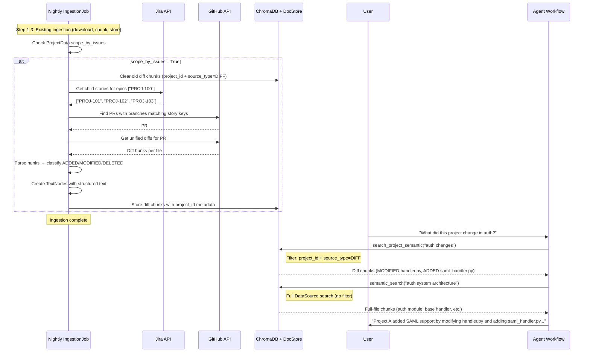

# Project Scoping v4: Implementation Plan

> All prior open questions resolved. This is the actionable plan.

## Resolved Decisions

| Question | Decision |
|---|---|
| PR ↔ Story linking | Branch name contains story key (e.g., branch `feature/PROJ-123-auth-refactor` → linked to story `PROJ-123`) |
| First issue tracker | Jira |
| Diff resolution timing | Inside the IngestionJob pipeline (nightly runs now, webhooks later) |
| Approach A (chunk tagging) | Dropped |
| Approach B (diff chunks) + C (prompt grounding) | Accepted |
| Separate search tools | Yes — both `search_project_semantic` AND `search_project_grep` |
| CodeSplitter for diffs | No — manual structured parsing |
| LLM calls for chunk text | No — purely structural generation from diff data |

---

## 1. Exact Diff Chunk Structure

> [!IMPORTANT]
> No LLM call is needed. The chunk text is **structurally generated** from the parsed diff data. The format is designed to be simultaneously good for embeddings AND clear for the agent.

### 1.1 MODIFIED Code

When a PR changes existing code (has both `-` and `+` lines in a hunk):

```python
TextNode(
    text=(
        "[PROJECT CHANGE | MODIFIED | src/auth/handler.py | PR #42]\n"
        "\n"
        "BEFORE:\n"
        "    if request.auth_type == 'oauth2':\n"
        "\n"
        "AFTER:\n"
        "    if request.auth_type == 'oauth2' or request.auth_type == 'saml':\n"
        "\n"
        "SURROUNDING CONTEXT:\n"
        "def handle_auth(request):\n"
        "    if request.auth_type == 'oauth2' or request.auth_type == 'saml':\n"
        "        return auth_flow(request)\n"
    ),
    metadata={
        "file_path": "src/auth/handler.py",
        "data_source_id": str(ds_id),
        "project_id": str(project_id),
        "source_type": "DIFF",
        "change_type": "modified",
        "pr_number": 42,
        "story_key": "PROJ-123",
        "raw_diff": "@@ -45,3 +45,3 @@\n-    if request.auth_type == 'oauth2':\n+    if request.auth_type == 'oauth2' or request.auth_type == 'saml':\n",
        "file_id": str(file_id),
    }
)
```

**Why this structure:**
- `BEFORE:` / `AFTER:` — agent sees *exactly* what changed, no guessing
- `SURROUNDING CONTEXT:` — the unchanged lines around the change (from the diff's context lines), so the embedding captures the semantic neighborhood and the agent understands *where* in the function this change lives
- Header line — embeds cleanly and makes the chunk self-describing when returned by search
- No LLM call — everything is extracted directly from the parsed unified diff

### 1.2 ADDED Code (new functions, new files)

When a hunk has only `+` lines (no corresponding `-` lines):

```python
TextNode(
    text=(
        "[PROJECT CHANGE | ADDED | src/auth/saml_handler.py | PR #42]\n"
        "\n"
        "ADDED CODE:\n"
        "def handle_saml(request):\n"
        "    \"\"\"Handle SAML authentication flow.\"\"\"\n"
        "    assertion = parse_saml_response(request.body)\n"
        "    return validate_assertion(assertion)\n"
    ),
    metadata={
        "source_type": "DIFF",
        "change_type": "added",
        ...
    }
)
```

### 1.3 DELETED Code

> [!CAUTION]
> This is the most critical format. The agent MUST understand this code **no longer exists**.

When a hunk has only `-` lines (no corresponding `+` lines):

```python
TextNode(
    text=(
        "[PROJECT CHANGE | DELETED | src/auth/legacy.py | PR #42]\n"
        "\n"
        "WARNING: The following code was REMOVED by this project and NO LONGER EXISTS in the codebase.\n"
        "\n"
        "REMOVED CODE:\n"
        "def handle_basic_auth(request):\n"
        "    username = request.headers.get('Authorization')\n"
        "    return validate_credentials(username)\n"
    ),
    metadata={
        "source_type": "DIFF",
        "change_type": "deleted",
        ...
    }
)
```

The `WARNING:` line is critical — it embeds into the vector representation and surfaces in search results, so the agent is immediately warned that this code was removed.

### 1.4 How Context Lines Are Extracted

A unified diff hunk looks like:

```diff
@@ -43,8 +43,8 @@
 class AuthHandler:
     def handle_auth(self, request):
-        if request.auth_type == 'oauth2':
+        if request.auth_type == 'oauth2' or request.auth_type == 'saml':
             return auth_flow(request)
         return unauthorized()
```

We parse this into:

| Category | Lines | How they appear in chunk text |
|---|---|---|
| Context (` ` prefix) | `class AuthHandler:`, `def handle_auth(...)`, `return auth_flow(...)`, `return unauthorized()` | Under `SURROUNDING CONTEXT:` |
| Removed (`-` prefix) | `if request.auth_type == 'oauth2':` | Under `BEFORE:` |
| Added (`+` prefix) | `if request.auth_type == 'oauth2' or request.auth_type == 'saml':` | Under `AFTER:` |

**No LLM call. No description generation. Pure structural transformation.**

---

## 2. Tool Design

### 2.1 Two New Project-Scoped Tools

```
Existing tools (unchanged):
  semantic_search(query, data_source_ids?)    → full DataSource scope (code + docs)
  grep_search(key_word, data_source_ids?)     → full DataSource scope (code + docs)

New tools (conditional):
  search_project_semantic(query)              → project diff chunks ONLY
  search_project_grep(key_word)               → project diff chunks ONLY
```

**`search_project_semantic`**: Searches ChromaDB with filters `project_id=current` AND `source_type=DIFF`. Returns diff chunks ranked by semantic similarity. The agent uses this for questions like _"What authentication changes did this project make?"_

**`search_project_grep`**: Searches DocStore chunks where `source_type=DIFF` AND `project_id=current` AND text matches the keyword. The agent uses this for questions like _"Did this project modify the `handle_auth` function?"_

### 2.2 Conditional Registration

> [!IMPORTANT]
> These tools are ONLY registered when `scope_by_issues` is enabled on at least one linked DataSource for the current project. If no project scoping is configured, the agent gets the existing tools only.

In `Tools.__init__`, we need to know whether the project has scoping enabled. This means we need to pass that configuration in:

```python
class Tools:
    def __init__(
        self,
        data_sources: list[DataSource],
        project_id: UUID,
        llm: LLMBase,
        chunk_retrieval_svc: ChunkRetrievalService,
        project_scoping_enabled: bool = False,  # NEW
    ):
        ...
        if project_scoping_enabled:
            self._search_project_semantic_tool = ...
            self._search_project_grep_tool = ...
```

The `AgentService.run_agent()` determines `project_scoping_enabled` by checking the `ProjectData` records for the project.

### 2.3 Tool Descriptions (What the Agent Sees)

```python
# search_project_semantic
description=(
    "Search ONLY the code changes this project introduced via its PRs. "
    "Returns diff chunks showing what was ADDED, MODIFIED, or DELETED. "
    "Use this to understand what THIS project specifically changed in the codebase. "
    "WARNING: Results marked as DELETED represent code that NO LONGER EXISTS — "
    "do not reference deleted code as if it still exists. "
    "For broader codebase context or documentation, use semantic_search instead."
)

# search_project_grep
description=(
    "Find EXACT keyword matches within ONLY the code changes this project introduced. "
    "Searches through the project's diff chunks (added, modified, and deleted code). "
    "Use this to check if this project touched a specific function, variable, or pattern. "
    "For searching the full codebase or documentation, use grep_search instead."
)
```

### 2.4 What This Means for Each Tool

| Tool | Scope | Searches | Returns |
|---|---|---|---|
| `semantic_search` | All DataSources (code + docs) | Full-file chunks + doc chunks | Standard chunks (file_path + content) |
| `grep_search` | All DataSources (code + docs) | Full-file chunks + doc chunks in DocStore | Standard chunks (file_path + content) |
| `search_project_semantic` | Project's diff chunks only | Diff-derived chunks in ChromaDB | Diff chunks (BEFORE/AFTER/ADDED/REMOVED + context) |
| `search_project_grep` | Project's diff chunks only | Diff-derived chunks in DocStore | Diff chunks (BEFORE/AFTER/ADDED/REMOVED + context) |
| `view_file_*` | Any file, unrestricted | Raw file via GitHub API | Full file content |
| `list_directory_*` | Any directory, unrestricted | Directory listing via GitHub API | Directory contents |

### 2.5 Scoping Rules

> [!IMPORTANT]
> Project-scoped search is **CODE ONLY** and **configuration-dependent**.

- The diff chunks are only created for **Repository** DataSources (type = `REPOSITORY`)
- They are only created when `scope_by_issues = True` on the `ProjectData` association
- **Documentation** DataSources continue with generic search across the full DataSource — no project-scoping needed (docs don't have the "200 projects in one repo" problem)
- The generic `semantic_search` and `grep_search` still return results from ALL DataSources including code — the agent uses these for broader architectural context
- The project-scoped tools give the agent a **targeted lens** into just the changes

---

## 3. Anti-Hallucination Measures

### 3.1 Chunk-Level Protections

Every diff chunk text starts with a structured header:
```
[PROJECT CHANGE | ADDED/MODIFIED/DELETED | file_path | PR #N]
```

This is baked into the embedding. When the agent retrieves these chunks, there is no ambiguity about whether this is "general codebase code" or "a project-specific change."

**For deletions specifically**, the text includes:
```
WARNING: The following code was REMOVED by this project and NO LONGER EXISTS in the codebase.
```

### 3.2 Prompt-Level Protections

The ResearchAgent prompt will include:

```markdown
## Project-Scoped Search Rules

When using `search_project_semantic` or `search_project_grep`:
- Results marked **DELETED** represent code that was REMOVED. Do NOT reference
  this code as if it currently exists. If you need to mention it, explicitly
  state it was removed.
- Results marked **ADDED** represent NEW code introduced by this project.
- Results marked **MODIFIED** show BEFORE/AFTER — the BEFORE code no longer
  exists in its original form.
- Do NOT attribute code found via `semantic_search` (full DataSource search)
  as being "part of this project" unless it also appears in project-scoped
  search results. The project only owns code shown in its diff chunks.
```

### 3.3 Synthesis-Level Protections

The SynthAgent prompt will include:

```markdown
- When citing project-specific changes, clearly distinguish between:
  a) Code this project ADDED (new functionality)
  b) Code this project MODIFIED (changed existing behavior)
  c) Code this project DELETED (removed functionality — no longer exists)
- Never present deleted code as current functionality.
- If referencing broader codebase code, make clear it is pre-existing
  context, not a contribution of this project.
```

---

## 4. Integration With Ingestion Pipeline

### Where Diff Resolution Fits

```
IngestionJob.run_ingestion_job()
  │
  ├── 1. _retrieve_data()                    ← Download files (EXISTING)
  ├── 2. code_chunk_and_store()              ← Chunk code files (EXISTING)
  ├── 3. docs_convert_chunk_and_store()      ← Chunk doc files (EXISTING)
  │
  └── 4. resolve_and_store_project_diffs()   ← NEW STEP
          │
          ├── For each ProjectData linked to this DataSource:
          │     └── if scope_by_issues == True:
          │           ├── a. Clear old diff chunks for this project
          │           ├── b. Call IssueTrackerProvider.resolve_stories(project.epics)
          │           ├── c. Call IssueTrackerProvider.resolve_prs(stories)
          │           │      (match by branch name containing story key)
          │           ├── d. Call RepositoryDataProvider.get_pr_diffs(pr_numbers)
          │           ├── e. Parse diffs into DiffHunk objects
          │           ├── f. Create TextNodes with structured text + metadata
          │           └── g. Store in ChromaDB + DocStore
          │
          └── Skip if scope_by_issues == False
```

### PR Linking Strategy (Branch Name Matching)

```python
async def resolve_prs(self, story_keys: list[str]) -> list[int]:
    """
    Find PRs whose branch name contains a story key.
    
    Example: story_key = "PROJ-123"
    Matches branches: "feature/PROJ-123-auth-refactor", "PROJ-123-fix", etc.
    """
    prs = []
    for story_key in story_keys:
        # GitHub API: list PRs, filter by head branch containing story key
        # Or: search PRs with query
        matching_prs = await self._search_prs_by_branch(story_key)
        prs.extend(matching_prs)
    return deduplicate(prs)
```

### Freshness Strategy

On each ingestion run:
1. **Delete** all existing diff chunks for this project (filter by `project_id` + `source_type=DIFF` in both ChromaDB and DocStore)
2. **Re-resolve** from Jira (epics → stories → PRs → diffs)
3. **Re-create** diff chunks from current state of PRs

This means the diff chunks always reflect the latest state of the project's PRs. As new PRs merge, the next ingestion picks them up. As old PRs are superseded, their diffs update.

---

## 5. Implementation Phases

### Phase 0: IssueTrackerDataProvider + DataProvider Refactor (Issue #6)

**Prerequisite.** Must be completed before diff chunk work begins.

- `DataProvider` → `RepositoryDataProvider` → `GithubDataProvider` hierarchy
- `IssueTrackerDataProvider` abstract base class
- `JiraDataProvider` implementation:
  - `resolve_stories(epic_keys)` → Jira API to get child issues of epics
  - `resolve_prs(story_keys)` → GitHub API to find PRs with matching branch names
  - `get_pr_diffs(pr_numbers)` → GitHub API to get unified diffs

This also needs:
- `GithubDataProvider` extended with a `get_pr_diff(pr_number)` method (using existing API patterns)
- Pydantic models: `PRDiff`, `DiffHunk`

### Phase 1: Schema + Configuration (S — Small)

- Add columns to `ProjectData`:
  - `scope_by_issues: bool = False`
  - `issue_tracker_provider: str | None` (e.g., `"jira"`)
- Alembic migration
- No new tables — diff chunks are TextNodes in existing ChromaDB + DocStore

### Phase 2: Diff Chunk Pipeline (M — Medium)

- **Unified diff parser** (`app/services/diff_parser.py` or similar):
  - Parse unified diff format into `DiffHunk` objects
  - Classify each hunk as `added` / `modified` / `deleted`
  - Extract `BEFORE` lines (`-` prefix), `AFTER` lines (`+` prefix), `CONTEXT` lines (` ` prefix)
  
- **Diff chunk creator** (`app/services/diff_chunk.py` or similar):
  - Convert `DiffHunk` objects into `TextNode`s with the structured text format from Section 1
  - Generate metadata: `project_id`, `source_type`, `change_type`, `pr_number`, `story_key`, `raw_diff`

- **Integration with IngestionJob**:
  - New method: `resolve_and_store_project_diffs()` in `ChunkInsertionService`
  - Called after `code_chunk_and_store()` in `IngestionJobService.run_ingestion_job()`
  - Clear old diff chunks → resolve → parse → create → store

### Phase 3: Project-Scoped Search Tools (M — Medium)

- **New methods in `ChunkRetrievalService`**:
  ```python
  async def search_project_semantic(self, query, project_id, llm, k=10) -> list[str]:
      """ChromaDB search filtered to source_type=DIFF + project_id."""
  
  async def search_project_grep(self, key_word, project_id, k=10) -> list[str]:
      """DocStore search filtered to source_type=DIFF + project_id."""
  ```

- **Conditional registration in `Tools`**:
  - Accept `project_scoping_enabled: bool` parameter
  - Only register `search_project_semantic` and `search_project_grep` when True
  - Add to PlanningAgent and ResearchAgent tool sets

- **Formatted output**: When returning diff chunks, include the structured BEFORE/AFTER/ADDED/REMOVED text clearly

### Phase 4: Prompt Grounding + Anti-Hallucination (S — Small)

- Update `planning.md`:
  - Add project scope section (changed files summary)
  - Add guidance on when to use `search_project_*` vs `semantic_search` / `grep_search`
  
- Update `research.md`:
  - Add project-scoped search rules
  - Add anti-hallucination instructions (deleted code warnings)
  
- Update `synth.md`:
  - Add formatting rules for project changes vs. existing codebase

- Update `workflow.py`:
  - Pass `project_scoping_enabled` flag + changed files summary into prompt context
  - Load project metadata (epics, story count, PR count) for prompt injection

### Phase 5: AgentService Wiring (S — Small)

- In `AgentService.run_agent()`:
  - Query `ProjectData` to check if `scope_by_issues` is enabled
  - Pass `project_scoping_enabled` to `Tools` constructor
  - Load compact file list from diff chunks metadata for prompt injection
  - Pass to `get_agentic_workflow()` as additional context

---

## 6. Data Flow Summary


